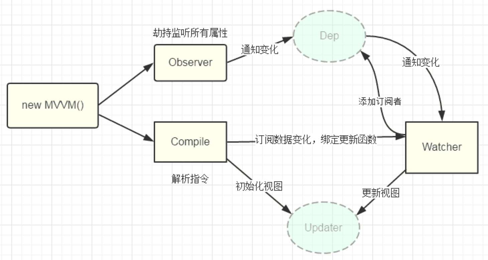

## 前言

记得第一次入手vue的时候是2017年年初，由于该框架在市面上很火，技术领导也就让我们入手，也就硬着头皮干上了。

也是因为已经接触了一年的React，所以上手Vue也稍微容易一点，着实用起来不错！

Vue 和 React整体也很相似，但是Vue写起来更舒服，更便捷，更清晰！个人比较喜欢这种html、css、js分开，一目了然！
这就是Vue 取了 Angular 的指令的灵感，加以优化！同时后期又取了React 的 Virtual DOM，以及组件化思想，都是重点在核心core库，其它功能，比如路由、状态管理交给相关库。

整体来说，Vue文档清晰规范，api设计简洁高效，对前端开发人员友好，上手快，甚至个人认为在很多场景使用Vue比React开发效率更高，简单易上手！是中小项目的最快速解决方案之一！

## 说一说我对于mvvm模型的理解吧



vue 的 双向绑定 也是 很方便的！

写了一段时间也是vue熟练了，其实也就是api 熟练级别，后边有出去面试，被问到，有没有看源码？其底层实现原理？什么设计思想？尴尬了！不会！才知道这个也要知其所以然！所以就抽空读起源码来...

#### 听过网上的这么一句话

<font color=red>编程世界和武侠世界比较像,每一个入门的程序员,都幻想自己有朝一日,神功大成,青衣长剑,救民于水火之中,但是其实大部分的人一开始学习方式就错了,导致一直无法进入高手的行列,就是过于看中招式,武器,而忽略了内功的修炼,所以任你慕容复有百家武学,还有被我乔峰一招制敌,所以这就是内功差距</font>

#### 原理就是内功修炼的捷径

#### 进入主题

* 原理
* https://developer.mozilla.org/zh-CN/docs/Web/JavaScript/Reference/Global_Objects/Object/defineProperty

```
Object.defineProperty(
    obj, // 要定义属性的对象。
    name, // 要定义或修改的属性的名称或 Symbol 。
    // 要定义或修改的属性描述符。
    {
        get:function(),
        set:function()
    }
)
```

* 手写一个自己的vuejs

mvvm主要分为两部

* rain-vue.js
1. 获取数据,先获取options
2. 把options.data的数据通过Object.key()解析
3. 进入主题 Obejct.defineProprety() 进行双向绑定
4. 接下来是两个类 Dep 和 Watcher (关系可以看上面的图片)
5. 实现computed

        5.1、computed是如何初始化，初始化之后干了些什么
        5.2、为何触发data值改变时computed会从新计算
        5.3、computed值为什么说是被缓存的呢，如何做的

* compile.js
1. 获取dom宿主节点 options.el
2. 把宿主节点拿出来遍历,高效 createDocumentFragment()
3. **编译过程** 判断是否是文本节点,如果是文本节点就通过正则的分组获取到{{}}插值表达式中间的值
4. **更新函数** 初始化更新函数,调用Watcher